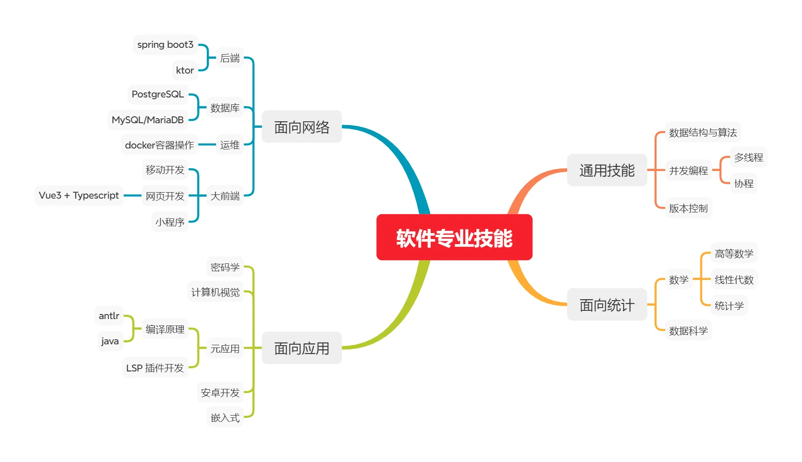

# 奥罗拉 开源技术与交流 小组

## 提前声明

由于个人有其他事要做(比如减肥，锻炼，接单)，不可能一直坐在电脑前打代码，我的安排请看 [项目的 project](https://github.com/orgs/aurora-learning-communicating/projects)

## 小组成员

- KurtSteiner (@kurt-steiner)

现阶段就我一个人，虽然知道一个人闭门造车不现实，但是就像 让子弹飞 中说的，**谁赢他们帮谁** ，现在我要做的是需要做出成绩让别人看到

## 📌 这个小组成立的动机

这个小组起源于小红书上的这个帖子：
[杭州，软件工程找不到工作的同学，组个队伍](https://www.xiaohongshu.com/discovery/item/67f22b7a000000000b02ea99?source=webshare&xhsshare=pc_web&xsec_token=ABPa8_du8XqckzqRDE8L3CvESEq6nPynpUn0nVcfL4fo4=&xsec_source=pc_share)

通过组队学习、项目实践和资源共享，互相帮助度过求职难关。

## 🚀 这个小组的目标

1. **技术提升** - 通过实际项目巩固编程能力
2. **作品集构建** - 共同开发有竞争力的项目作为求职作品
3. **面试准备** - 分享面经和刷题经验
4. **资源共享** - 优质学习资料和求职信息互通

## 👨‍💻 技术栈方向

这本来是我为自己规划的技术栈，有点杂乱，不过我已经将他们归类，还有一些要点没有扩展  
可以将这个技术栈作为一个参考，你可以在上面找到自己的专业能力并进行项目创建

## 📂 当前项目

- [app-idea](https://github.com/aurora-learning-communicating/app-ideas)
- [用Java实现简易ORM框架（学习项目）](https://github.com/aurora-learning-communicating/make-a-orm)

## 🤝 如何加入

1. 发送GitHub用户名到组织者邮箱（或小红书联系原帖作者）
2. 说明你的：
   - 技术背景
   - 学习/求职方向
   - 每周可投入时间

## 🏷️ 行为准则

- 尊重每个成员的学习节奏
- 积极分享但禁止商业广告
- 当你把项目放到简历中时，自己在开发中的职责一定要确认

## 工作行为参考

### 精力管理工具

1. 看板
2. 番茄钟
3. 艾森豪威尔矩阵

### 思路整理

多写文档，多记录，有时候工作的时候容易钻牛角尖，找不到努力方向，这个时候需要外部的记录来帮助整理思路  
这个方法参考自 **提问的艺术** ，在提出自己的问题的时候，自己的思路会慢慢变得清晰
